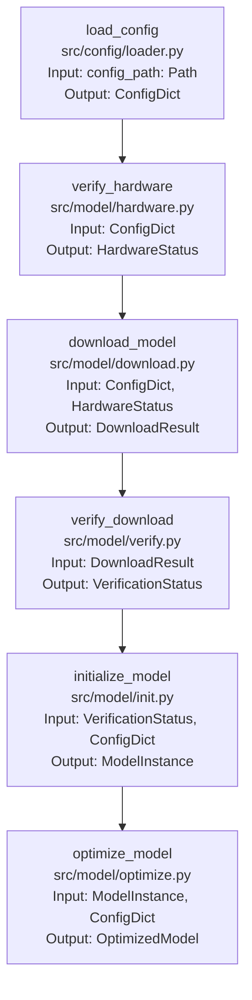

#### Function Specifications

1. **load_config** (`src/config/loader.py`)
   ```python
   from pathlib import Path
   
   def load_config(config_path: Path) -> ConfigDict:
       """
       Loads and validates model configuration from YAML file.
       
       Args:
           config_path: Path to configuration file
       
       Returns:
           ConfigDict: Validated configuration dictionary
       
       Raises:
           ConfigError: If configuration is invalid
           FileNotFoundError: If config file doesn't exist
       """
   ```

#### Data Types

1. **ConfigDict**
   ```python
   from pathlib import Path
   
   class ConfigDict(TypedDict):
       name: str
       repo_id: str
       hardware: HardwareConfig
       loading: LoadingConfig
       quantization: QuantizationConfig
       prompt: PromptConfig
       inference: InferenceConfig
       model_path: Path  # Changed from str to Path
       cache_path: Path  # Changed from str to Path
   ```

2. **HardwareStatus**
   ```python
   class HardwareStatus(TypedDict):
       gpu_available: bool
       gpu_memory: int
       compute_capability: float
       disk_space: int
       network_available: bool
       temp_dir: Path  # Changed from str to Path
   ```

3. **DownloadResult**
   ```python
   class DownloadResult(TypedDict):
       model_path: Path  # Changed from str to Path
       checksums: Dict[str, str]
       download_time: float
       total_size: int
   ```

#### Detailed Function Pipeline

