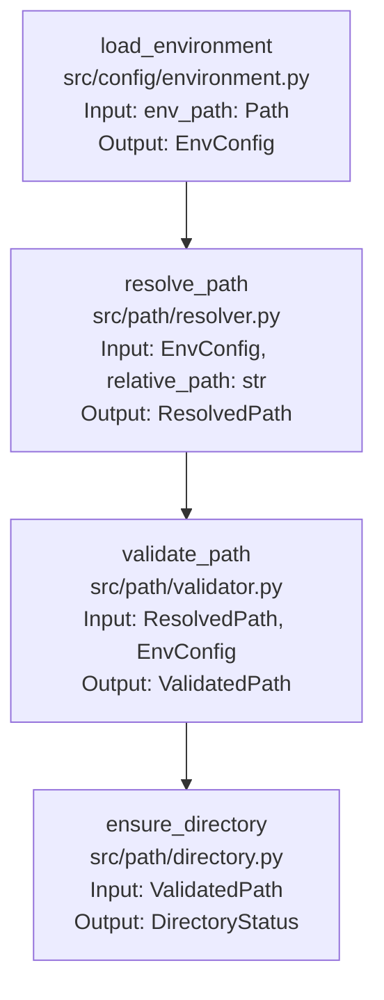

# Project Structure Documentation - Path Configuration

## Path Management

### 1. Path Configuration Pipeline

#### Overview
The project implements a robust, platform-independent path management system using `pathlib.Path`. This system ensures consistent path handling across different operating systems and environments while maintaining security and proper error handling.

#### Core Components

1. **Environment Configuration (`config/environment.yaml`)**
   - Defines base paths and environment-specific settings
   - Contains path validation rules
   - Specifies directory permissions and access patterns

2. **Path Resolver Module (`src/path/resolver.py`)**
   - Primary responsibility: Path resolution and validation
   - Dependencies:
     - Input: Environment configuration
     - Input: Relative path requests
     - Output: Resolved and validated Path objects

3. **Path Validator Module (`src/path/validator.py`)**
   - Primary responsibility: Path security and validation
   - Dependencies:
     - Input: Path objects to validate
     - Input: Validation rules
     - Output: Validation results

#### Data Flow

```
[environment.yaml] → [Path Resolver] → [Path Validator] → [Validated Paths]
```

#### Detailed Function Pipeline



#### Function Specifications

1. **load_environment** (`src/config/environment.py`)
   ```python
   from pathlib import Path
   
   def load_environment(env_path: Path) -> EnvConfig:
       """
       Loads and validates environment configuration.
       
       Args:
           env_path: Path to environment configuration file
       
       Returns:
           EnvConfig: Validated environment configuration
       
       Raises:
           EnvConfigError: If configuration is invalid
           FileNotFoundError: If config file doesn't exist
       """
   ```

2. **resolve_path** (`src/path/resolver.py`)
   ```python
   def resolve_path(config: EnvConfig, relative_path: str) -> ResolvedPath:
       """
       Resolves relative paths against project root.
       
       Args:
           config: Environment configuration
           relative_path: Path to resolve
       
       Returns:
           ResolvedPath: Absolute path object
       
       Raises:
           PathResolutionError: If path cannot be resolved
       """
   ```

3. **validate_path** (`src/path/validator.py`)
   ```python
   def validate_path(path: ResolvedPath, config: EnvConfig) -> ValidatedPath:
       """
       Validates path against security and project rules.
       
       Args:
           path: Path to validate
           config: Environment configuration
       
       Returns:
           ValidatedPath: Validated path object
       
       Raises:
           PathValidationError: If path is invalid
       """
   ```

4. **ensure_directory** (`src/path/directory.py`)
   ```python
   def ensure_directory(path: ValidatedPath) -> DirectoryStatus:
       """
       Ensures directory exists with correct permissions.
       
       Args:
           path: Path to directory
       
       Returns:
           DirectoryStatus: Directory status information
       
       Raises:
           DirectoryError: If directory cannot be created
       """
   ```

#### Data Types

1. **EnvConfig**
   ```python
   from pathlib import Path
   
   class EnvConfig(TypedDict):
       project_root: Path
       config_dir: Path
       model_dir: Path
       cache_dir: Path
       data_dir: Path
       log_dir: Path
       temp_dir: Path
       validation_rules: ValidationRules
   ```

2. **ResolvedPath**
   ```python
   class ResolvedPath:
       absolute: Path
       relative: str
       base: Path
       components: List[str]
   ```

3. **ValidatedPath**
   ```python
   class ValidatedPath(ResolvedPath):
       is_valid: bool
       validation_errors: List[str]
       permissions: Dict[str, bool]
   ```

4. **DirectoryStatus**
   ```python
   class DirectoryStatus(TypedDict):
       exists: bool
       created: bool
       permissions: Dict[str, bool]
       size: int
   ```

#### Error Handling Points

1. **Path Resolution**
   - Path traversal prevention
   - Invalid character detection
   - Maximum length validation
   - Platform-specific validation

2. **Path Validation**
   - Security boundary checks
   - Permission validation
   - Directory structure validation
   - Access pattern validation

3. **Directory Management**
   - Permission setting
   - Directory creation
   - Cleanup procedures
   - Space management

#### Configuration Dependencies

1. **Environment Variables**
   - PROJECT_ROOT: Base project directory
   - ENVIRONMENT: Current environment (dev/prod)
   - USER_HOME: User's home directory
   - TEMP_DIR: System temp directory

2. **Path Rules**
   - Maximum path length
   - Allowed characters
   - Required permissions
   - Directory structure

3. **Security Rules**
   - Path traversal prevention
   - Permission boundaries
   - Access patterns
   - Cleanup policies

#### Success Criteria

1. All paths resolve correctly on target platform
2. Path validation passes all security checks
3. Directories created with correct permissions
4. No path traversal vulnerabilities
5. Proper error handling for all path operations

#### Recovery Procedures

1. **Path Resolution Failures**
   - Fallback to alternative paths
   - Clean path components
   - Log resolution attempts
   - Provide clear error messages

2. **Validation Failures**
   - Attempt permission fixes
   - Suggest alternative paths
   - Log validation errors
   - Provide security warnings

#### Future Considerations

1. Path caching for performance
2. Distributed path management
3. Cloud storage integration
4. Path monitoring and auditing
5. Automated path cleanup

#### Project Path Structure

```yaml
# config/environment.yaml
paths:
  # Base directories
  project_root: "${PROJECT_ROOT}"  # Required environment variable
  user_home: "${USER_HOME}"        # Required environment variable
  
  # Core project directories
  src: "${project_root}/src"       # Source code
  config: "${project_root}/config" # Configuration files
  tests: "${project_root}/tests"   # Test files
  
  # Data directories
  data:
    input: "${project_root}/data/input"    # Input data
    output: "${project_root}/data/output"  # Output data
    processed: "${project_root}/data/processed"  # Processed data
  
  # Model directories
  models:
    base: "${project_root}/models"         # Base model directory
    pixtral: "${models.base}/pixtral-12b" # Specific model directory
    cache: "${models.base}/cache"          # Model cache
  
  # System directories
  logs: "${project_root}/logs"     # Log files
  temp: "${TEMP_DIR}/project"      # Temporary files
  cache: "${project_root}/cache"   # Project cache

  # Environment-specific overrides
  development:
    temp: "${project_root}/temp"   # Dev-specific temp directory
    cache: "${project_root}/.cache" # Dev-specific cache
  
  production:
    temp: "/var/tmp/project"       # Prod-specific temp directory
    cache: "/var/cache/project"    # Prod-specific cache
```

#### Path Resolution Rules

1. **Base Path Resolution**
   - All paths are relative to `project_root`
   - Environment variables are resolved first
   - Path variables (${var}) are resolved second
   - Platform-specific separators are applied last

2. **Path Variable Substitution**
   - `${project_root}`: Base project directory
   - `${user_home}`: User's home directory
   - `${TEMP_DIR}`: System temp directory
   - `${models.base}`: Base models directory
   - Custom variables can be defined in environment.yaml

3. **Environment-Specific Paths**
   - Development paths override base paths
   - Production paths override development paths
   - Environment is determined by ENVIRONMENT variable

4. **Path Validation Rules**
   - All paths must be within project boundaries
   - No path may reference parent directories
   - All paths must use forward slashes
   - Maximum path length: 4096 characters 

#### Centralized Path Repository

The project uses a single source of truth for all paths through a centralized repository pattern:

```python
# src/path/repository.py
from pathlib import Path
from typing import ClassVar

class PathRepository:
    """Centralized repository for all project paths."""
    
    # Singleton instance
    _instance: ClassVar['PathRepository'] = None
    
    @classmethod
    def get_instance(cls) -> 'PathRepository':
        """Get the singleton instance of the path repository."""
        if cls._instance is None:
            cls._instance = cls()
        return cls._instance
    
    def __init__(self):
        """Initialize the path repository with resolved paths."""
        self._config = load_environment(Path("config/environment.yaml"))
        self._paths = self._resolve_all_paths()
    
    def _resolve_all_paths(self) -> Dict[str, Path]:
        """Resolve all paths from configuration."""
        return {
            # Core paths
            "project_root": self._resolve_path(self._config.project_root),
            "src": self._resolve_path(self._config.src),
            "config": self._resolve_path(self._config.config),
            "tests": self._resolve_path(self._config.tests),
            
            # Data paths
            "data_input": self._resolve_path(self._config.data.input),
            "data_output": self._resolve_path(self._config.data.output),
            "data_processed": self._resolve_path(self._config.data.processed),
            
            # Model paths
            "models_base": self._resolve_path(self._config.models.base),
            "models_pixtral": self._resolve_path(self._config.models.pixtral),
            "models_cache": self._resolve_path(self._config.models.cache),
            
            # System paths
            "logs": self._resolve_path(self._config.logs),
            "temp": self._resolve_path(self._config.temp),
            "cache": self._resolve_path(self._config.cache),
        }
    
    def get_path(self, path_key: str) -> Path:
        """Get a resolved path by its key."""
        if path_key not in self._paths:
            raise KeyError(f"Unknown path key: {path_key}")
        return self._paths[path_key]
    
    def get_all_paths(self) -> Dict[str, Path]:
        """Get all resolved paths."""
        return self._paths.copy()
```

#### Usage Pattern

All modules that need paths should import and use the path repository:

```python
# src/model/download.py
from src.path.repository import PathRepository

def download_model(config: ConfigDict) -> DownloadResult:
    """Download model using paths from repository."""
    paths = PathRepository.get_instance()
    
    # Use repository paths
    model_dir = paths.get_path("models_pixtral")
    cache_dir = paths.get_path("models_cache")
    
    # ... rest of function
```

#### Benefits

1. **Single Source of Truth**
   - All paths defined in one place
   - No duplicate path definitions
   - Consistent path resolution

2. **Easy Maintenance**
   - Change paths in one place
   - All modules automatically use updated paths
   - No need to update multiple files

3. **Type Safety**
   - All paths are Path objects
   - IDE support for path operations
   - Runtime type checking

4. **Lazy Loading**
   - Paths resolved only when needed
   - Environment variables loaded once
   - Efficient path resolution

5. **Testing Support**
   - Easy to mock path repository
   - Test-specific paths can be injected
   - Isolated path testing

#### Integration with Existing Code

1. **Model Download Module**
   ```python
   # src/model/download.py
   def download_model(config: ConfigDict) -> DownloadResult:
       paths = PathRepository.get_instance()
       model_path = paths.get_path("models_pixtral")
       # ... use model_path
   ```

2. **Data Processing Module**
   ```python
   # src/data/processor.py
   def process_data(input_data: Any) -> ProcessedData:
       paths = PathRepository.get_instance()
       input_dir = paths.get_path("data_input")
       output_dir = paths.get_path("data_output")
       # ... use paths
   ```

3. **Logging Module**
   ```python
   # src/utils/logger.py
   def setup_logging() -> None:
       paths = PathRepository.get_instance()
       log_dir = paths.get_path("logs")
       # ... setup logging
   ```

This pattern ensures that all path-related code is centralized, maintainable, and consistent across the project. 

#### Path Management During Development

1. **Path Registration Process**
   ```python
   # src/path/registry.py
   from enum import Enum, auto
   
   class PathCategory(Enum):
       """Categories for path validation and organization."""
       CORE = auto()      # Core project paths (src, config, tests)
       DATA = auto()      # Data-related paths
       MODEL = auto()     # Model-related paths
       SYSTEM = auto()    # System paths (logs, temp, cache)
       CUSTOM = auto()    # Custom module-specific paths
   
   class PathRegistry:
       """Registry for tracking and validating all project paths."""
       
       def register_path(
           self,
           key: str,
           category: PathCategory,
           description: str,
           required: bool = True,
           parent: Optional[str] = None
       ) -> None:
           """
           Register a new path in the project.
           
           Args:
               key: Unique identifier for the path
               category: Path category for organization
               description: Purpose of the path
               required: Whether the path must exist
               parent: Parent path key if this is a subdirectory
           """
   ```

2. **Path Validation in CI/CD**
   ```yaml
   # .github/workflows/path-validation.yml
   name: Path Validation
   
   on:
     pull_request:
       paths:
         - 'src/**'
         - 'config/**'
   
   jobs:
     validate-paths:
       runs-on: ubuntu-latest
       steps:
         - uses: actions/checkout@v2
         - name: Validate Paths
           run: |
             python -m src.path.validator --check-registry
             python -m src.path.validator --check-usage
   ```

3. **Development Guidelines**

   a. **Adding New Paths**
   ```python
   # When adding a new module that needs paths:
   
   # 1. Register the path in the registry
   registry = PathRegistry.get_instance()
   registry.register_path(
       key="new_module_data",
       category=PathCategory.DATA,
       description="Storage for new module data",
       parent="data_input"  # Optional parent path
   )
   
   # 2. Use the path in your module
   paths = PathRepository.get_instance()
   data_path = paths.get_path("new_module_data")
   ```

   b. **Path Documentation**
   ```markdown
   # docs/paths.md
   
   ## Project Paths
   
   ### Core Paths
   - `project_root`: Base project directory
   - `src`: Source code directory
   
   ### Data Paths
   - `data_input`: Input data directory
   - `new_module_data`: Data for new module
   
   ### Model Paths
   - `models_base`: Base model directory
   - `models_pixtral`: Pixtral model directory
   ```

4. **Path Usage Validation**
   ```python
   # src/path/validator.py
   
   def validate_path_usage() -> List[PathValidationError]:
       """
       Validate that all registered paths are properly used.
       
       Returns:
           List of validation errors
       """
       # Check for:
       # 1. Unused registered paths
       # 2. Unregistered path usage
       # 3. Invalid path references
       # 4. Missing required paths
   ```

5. **Development Workflow**

   a. **Adding a New Module with Paths**
   1. Register required paths in `PathRegistry`
   2. Add path documentation to `docs/paths.md`
   3. Use paths through `PathRepository`
   4. Run path validation tests
   5. Submit PR with path changes

   b. **Modifying Existing Paths**
   1. Update path registration if needed
   2. Update documentation
   3. Run path validation
   4. Update dependent modules
   5. Submit PR with changes

6. **Automated Checks**

   a. **Pre-commit Hooks**
   ```yaml
   # .pre-commit-config.yaml
   repos:
     - repo: local
       hooks:
         - id: validate-paths
           name: Validate Paths
           entry: python -m src.path.validator --pre-commit
           language: python
   ```

   b. **IDE Integration**
   ```json
   // .vscode/settings.json
   {
     "python.analysis.extraPaths": [
       "./src"
     ],
     "python.linting.enabled": true,
     "python.linting.pylintEnabled": true,
     "python.linting.pylintArgs": [
       "--load-plugins=src.path.linter"
     ]
   }
   ```

7. **Path Migration Tools**
   ```python
   # src/path/migrate.py
   
   def migrate_paths(old_key: str, new_key: str) -> None:
       """
       Migrate path usage from old key to new key.
       
       Args:
           old_key: Old path key
           new_key: New path key
       """
       # 1. Update path registry
       # 2. Update documentation
       # 3. Find and update usages
       # 4. Run validation
   ```

This system ensures that:
- All paths are properly registered
- Path usage is consistent
- Changes are tracked and validated
- Documentation stays up to date
- Migration is handled safely 