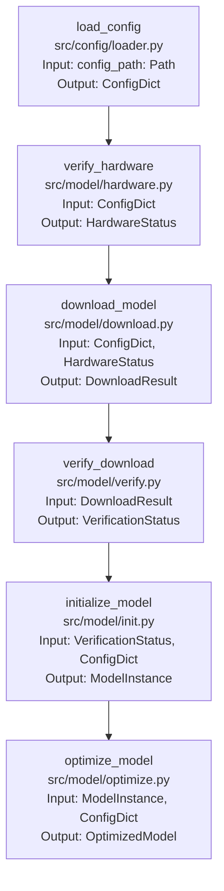

# Project Structure Documentation - Model Download

## Model Management

### 1. Model Download Pipeline

#### Overview
The project uses the Pixtral-12B model from Hugging Face for invoice processing. The model download and initialization process is designed to be robust, configurable, and error-resistant.

#### Core Components

1. **Model Configuration (`config/models/pixtral.yaml`)**
   - Defines model specifications and requirements
   - Contains loading strategies and hardware requirements
   - Specifies quantization options and inference parameters

2. **Model Download Module (`src/model/download.py`)**
   - Primary responsibility: Safe model download and verification
   - Dependencies:
     - Input: Configuration from `pixtral.yaml`
     - Output: Downloaded model files in `models/pixtral-12b/`

3. **Model Initialization Module (`src/model/init.py`)**
   - Primary responsibility: Model loading and optimization
   - Dependencies:
     - Input: Downloaded model files
     - Input: Configuration from `pixtral.yaml`
     - Output: Initialized model instance

#### Data Flow

```
[pixtral.yaml] → [Download Module] → [Model Files] → [Init Module] → [Ready Model]
```

#### Detailed Function Pipeline



#### Function Specifications

1. **load_config** (`src/config/loader.py`)
   ```python
   from pathlib import Path
   
   def load_config(config_path: Path) -> ConfigDict:
       """
       Loads and validates model configuration from YAML file.
       
       Args:
           config_path: Path to configuration file
       
       Returns:
           ConfigDict: Validated configuration dictionary
       
       Raises:
           ConfigError: If configuration is invalid
           FileNotFoundError: If config file doesn't exist
       """
   ```

2. **verify_hardware** (`src/model/hardware.py`)
   ```python
   def verify_hardware(config: ConfigDict) -> HardwareStatus:
       """
       Verifies system meets model requirements.
       
       Args:
           config: Model configuration dictionary
       
       Returns:
           HardwareStatus: Contains GPU info, memory status, etc.
       
       Raises:
           HardwareError: If requirements not met
       """
   ```

3. **download_model** (`src/model/download.py`)
   ```python
   def download_model(config: ConfigDict, hw_status: HardwareStatus) -> DownloadResult:
       """
       Downloads model files from Hugging Face.
       
       Args:
           config: Model configuration
           hw_status: Hardware verification results
       
       Returns:
           DownloadResult: Contains download path, checksums, etc.
       
       Raises:
           DownloadError: If download fails
       """
   ```

4. **verify_download** (`src/model/verify.py`)
   ```python
   def verify_download(download_result: DownloadResult) -> VerificationStatus:
       """
       Verifies downloaded model files.
       
       Args:
           download_result: Results from download process
       
       Returns:
           VerificationStatus: Contains verification results
       
       Raises:
           VerificationError: If verification fails
       """
   ```

5. **initialize_model** (`src/model/init.py`)
   ```python
   def initialize_model(verification: VerificationStatus, config: ConfigDict) -> ModelInstance:
       """
       Initializes model with specified configuration.
       
       Args:
           verification: Download verification results
           config: Model configuration
       
       Returns:
           ModelInstance: Initialized model object
       
       Raises:
           InitializationError: If initialization fails
       """
   ```

6. **optimize_model** (`src/model/optimize.py`)
   ```python
   def optimize_model(model: ModelInstance, config: ConfigDict) -> OptimizedModel:
       """
       Applies optimization settings to model.
       
       Args:
           model: Initialized model instance
           config: Model configuration
       
       Returns:
           OptimizedModel: Optimized model instance
       
       Raises:
           OptimizationError: If optimization fails
       """
   ```

#### Data Types

1. **ConfigDict**
   ```python
   from pathlib import Path
   
   class ConfigDict(TypedDict):
       name: str
       repo_id: str
       hardware: HardwareConfig
       loading: LoadingConfig
       quantization: QuantizationConfig
       prompt: PromptConfig
       inference: InferenceConfig
       model_path: Path
       cache_path: Path
   ```

2. **HardwareStatus**
   ```python
   class HardwareStatus(TypedDict):
       gpu_available: bool
       gpu_memory: int
       compute_capability: float
       disk_space: int
       network_available: bool
       temp_dir: Path
   ```

3. **DownloadResult**
   ```python
   class DownloadResult(TypedDict):
       model_path: Path
       checksums: Dict[str, str]
       download_time: float
       total_size: int
   ```

4. **VerificationStatus**
   ```python
   class VerificationStatus(TypedDict):
       verified: bool
       checksum_matches: bool
       file_count: int
       total_size: int
   ```

5. **ModelInstance**
   ```python
   class ModelInstance:
       model: Any  # Actual model object
       processor: Any  # Model processor
       device: str
       dtype: str
   ```

6. **OptimizedModel**
   ```python
   class OptimizedModel(ModelInstance):
       memory_usage: int
       gpu_utilization: float
       inference_time: float
   ```

#### Error Handling Points

1. **Pre-download Checks**
   - GPU availability verification
   - Memory requirements validation
   - Disk space verification
   - Network connectivity check

2. **Download Process**
   - Checksum verification
   - Download interruption recovery
   - Partial download cleanup
   - Version compatibility check

3. **Initialization Safeguards**
   - Hardware compatibility verification
   - Memory optimization selection
   - Quantization validation
   - Model health check

#### Configuration Dependencies

1. **Hardware Requirements**
   - Minimum GPU memory: 24GB
   - Compute capability: 7.5+
   - Recommended GPU: A4000 or better

2. **Loading Parameters**
   - Default dtype: bfloat16
   - Device mapping: CUDA-aware
   - Attention implementation: eager
   - Flash Attention 2: configurable

3. **Quantization Options**
   - bfloat16 (default)
   - int8 with fp8 quantization
   - int4 with nf4 quantization

#### Success Criteria

1. Model files completely downloaded and verified
2. Model loads without errors in specified configuration
3. Basic inference test passes
4. Memory usage within specified bounds
5. GPU utilization below 80% threshold

#### Recovery Procedures

1. **Download Failures**
   - Implement retry mechanism (max 2 attempts)
   - Clean partial downloads
   - Fall back to minimal parameter configuration

2. **Initialization Failures**
   - Log detailed error information
   - Attempt alternative quantization options
   - Provide clear error messages for common failures

#### Future Considerations

1. Model version tracking
2. Automatic updates handling
3. Multi-GPU support
4. Distributed download capabilities
5. Cache management for multiple configurations
