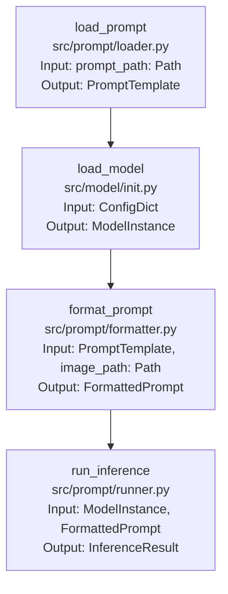

# Project Structure Documentation - Load and Run Prompt

## Prompt Execution Pipeline

### 1. Overview
The prompt execution system handles running configured prompts through the Pixtral model for invoice data extraction. The process is designed to be simple, configurable, and efficient, allowing users to select from different prompt strategies and quantization options.

### 2. Core Components

1. **Prompt Configuration (`config/prompts/`)**
   - Contains 5 prompt strategy templates:
     - basic_extraction.yaml
     - detailed.yaml
     - few_shot.yaml
     - step_by_step.yaml
     - locational.yaml
   - Each template defines the prompt structure and field-specific instructions
   - Templates follow model's required format: `<s>[INST]...[/INST>`

2. **Model Configuration (`config/models/pixtral.yaml`)**
   - Defines model loading parameters
   - Specifies quantization options:
     - bfloat16 (default)
     - int8 with fp8 quantization
     - int4 with nf4 quantization
   - Contains prompt format template
   - Specifies hardware requirements

3. **Prompt Runner Module (`src/prompt/runner.py`)**
   - Primary responsibility: Execute prompts through model
   - Dependencies:
     - Input: Selected prompt template
     - Input: Model configuration
     - Input: Image directory path
     - Output: Extraction results
   - Handles batch processing of images
   - Manages memory and performance optimization

### 3. Data Flow
```
[Prompt Template] → [Model Config] → [Prompt Runner] → [Results]
```

### 4. Detailed Function Pipeline


### 5. Function Specifications

1. **load_prompt** (`src/prompt/loader.py`)
```python
def load_prompt(prompt_path: Path) -> PromptTemplate:
    """
    Loads and validates prompt template from YAML file.
    
    Args:
        prompt_path: Path to prompt template file
    
    Returns:
        PromptTemplate: Validated prompt template
    
    Raises:
        PromptError: If template is invalid
        FileNotFoundError: If template file doesn't exist
    """
```

2. **format_prompt** (`src/prompt/formatter.py`)
```python
def format_prompt(template: PromptTemplate, image_path: Path) -> FormattedPrompt:
    """
    Formats prompt with image according to model requirements.
    
    Args:
        template: Loaded prompt template
        image_path: Path to input image
    
    Returns:
        FormattedPrompt: Prompt ready for model input
    
    Raises:
        FormatError: If formatting fails
    """
```

3. **run_inference** (`src/prompt/runner.py`)
```python
def run_inference(model: ModelInstance, prompt: FormattedPrompt) -> InferenceResult:
    """
    Runs prompt through model and collects results.
    
    Args:
        model: Initialized model instance
        prompt: Formatted prompt
    
    Returns:
        InferenceResult: Model output and metadata
    
    Raises:
        InferenceError: If inference fails
    """
```

### 6. Data Types

1. **PromptTemplate**
```python
class PromptTemplate(TypedDict):
    name: str
    description: str
    template: str
    field: str
    validation_rules: Dict[str, Any]
```

2. **FormattedPrompt**
```python
class FormattedPrompt(TypedDict):
    text: str
    image: Any  # PIL Image or tensor
    metadata: Dict[str, Any]
```

3. **InferenceResult**
```python
class InferenceResult(TypedDict):
    output: str
    confidence: float
    processing_time: float
    metadata: Dict[str, Any]
```

### 7. Error Handling Points

1. **Prompt Loading**
   - Template validation
   - Field specification check
   - Format compatibility verification
   - Recovery: Fallback to default template

2. **Prompt Formatting**
   - Image loading verification
   - Template variable substitution
   - Format compliance check
   - Recovery: Log and skip invalid images

3. **Inference Execution**
   - Model state verification
   - Memory management
   - Timeout handling
   - Recovery: Implement retry mechanism

### 8. Configuration Dependencies

1. **Prompt Format**
   - Must match model's expected format: `<s>[INST]...[/INST>`
   - Must include `[IMG]` placeholder
   - Must specify target field
   - Must include validation rules

2. **Model Requirements**
   - Quantization configuration
   - Memory constraints
   - Batch size limits
   - Hardware requirements

### 9. Success Criteria

1. Prompt template loads without errors
2. Image successfully integrated into prompt
3. Model returns valid extraction result
4. Processing time within acceptable range
5. Memory usage within specified bounds
6. Results match expected format

### 10. Recovery Procedures

1. **Prompt Loading Failures**
   - Fallback to default template
   - Log template validation errors
   - Provide clear error messages
   - Maintain system stability

2. **Inference Failures**
   - Implement retry mechanism
   - Log detailed error information
   - Provide fallback strategies
   - Clean up resources

### 11. Future Considerations

1. **Performance Optimization**
   - Batch processing support
   - Result caching
   - Memory optimization
   - Parallel processing

2. **Error Handling**
   - Error pattern analysis
   - Automated recovery
   - Detailed logging
   - User notifications

3. **Feature Enhancements**
   - Automated prompt tuning
   - Result validation
   - Performance metrics
   - User feedback integration

### 12. Integration Points

1. **Model Integration**
   - Model loading and configuration
   - Quantization options
   - Memory management
   - Performance optimization

2. **Data Integration**
   - Image loading and processing
   - Result storage
   - Validation rules
   - Error handling

3. **User Interface**
   - Configuration selection
   - Progress monitoring
   - Result display
   - Error reporting

### 13. Testing Strategy

1. **Unit Tests**
   - Prompt loading
   - Format validation
   - Image processing
   - Result parsing

2. **Integration Tests**
   - End-to-end workflow
   - Error handling
   - Performance metrics
   - Resource management

3. **Validation Tests**
   - Result accuracy
   - Format compliance
   - Error recovery
   - Performance benchmarks

### 14. Documentation Requirements

1. **User Documentation**
   - Configuration guide
   - Usage examples
   - Error handling
   - Best practices

2. **Developer Documentation**
   - API reference
   - Architecture overview
   - Extension points
   - Testing guidelines

3. **Maintenance Documentation**
   - Troubleshooting guide
   - Performance tuning
   - Error patterns
   - Update procedures 